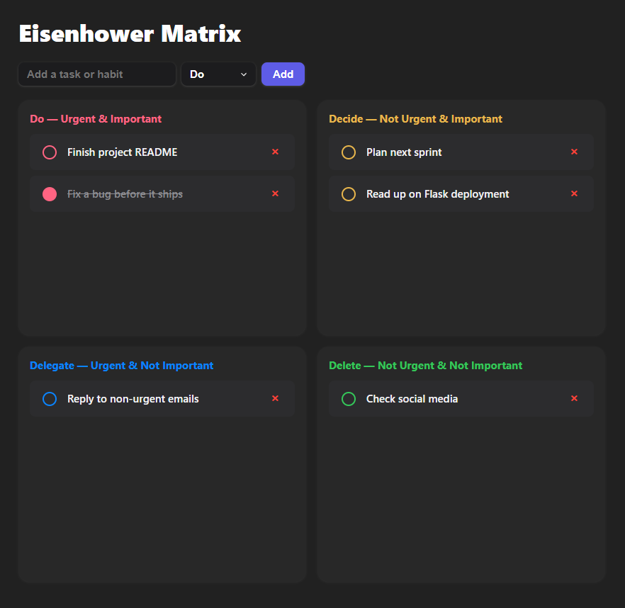

# Eisenhower Matrix

A CRUD web app for organising tasks by urgency and importance, using the Eisenhower matrix method — four quadrants, each holding its own tasks.

**[Live demo](https://eisenhower-matrix-w38v.onrender.com)**



## Features

- Add a task to any of the four quadrants
- Mark tasks complete with a checkbox
- Delete tasks
- Everything persists — tasks survive a page refresh and a server restart

## Tech stack

- **Frontend:** HTML, CSS, JavaScript (no framework)
- **Backend:** Flask (Python)
- **Database:** SQLite
- **Deployment:** Render, running gunicorn

## API

| Method | Endpoint | Purpose |
| --- | --- | --- |
| `GET` | `/api/tasks` | Return all tasks as JSON |
| `POST` | `/api/tasks` | Create a task |
| `PUT` | `/api/tasks/<id>` | Update a task's completed state |
| `DELETE` | `/api/tasks/<id>` | Delete a task |

## Running locally

```bash
git clone https://github.com/blech0/eisenhower-matrix
cd eisenhower-matrix
pip install -r requirements.txt
python app.py
```

Then open <http://127.0.0.1:5000> in your browser. The SQLite database file is created automatically on first run.

## Tests

```bash
pytest
```

Four tests covering the core API: reading tasks, creating a task and confirming it persists, and rejecting a malformed request with a `400` instead of crashing.

## Known limitations

- Single user, no accounts or authentication
- Hosted on Render's free tier, which wipes the filesystem on restart — so the SQLite database resets periodically. Moving to a managed database (e.g. Postgres) would fix this.
